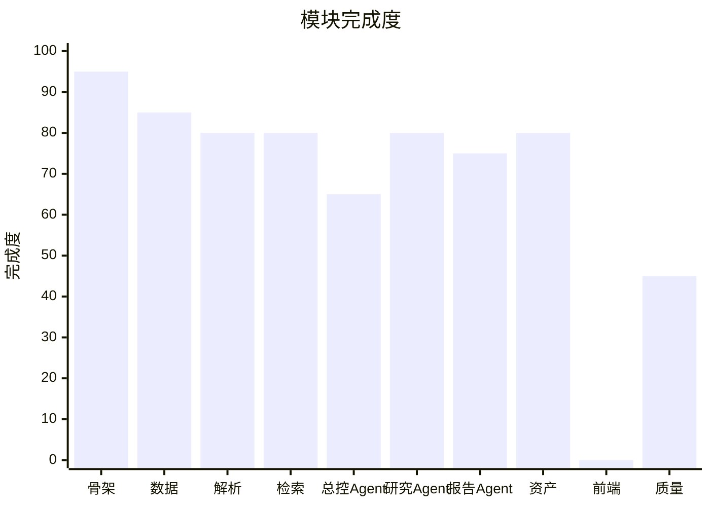
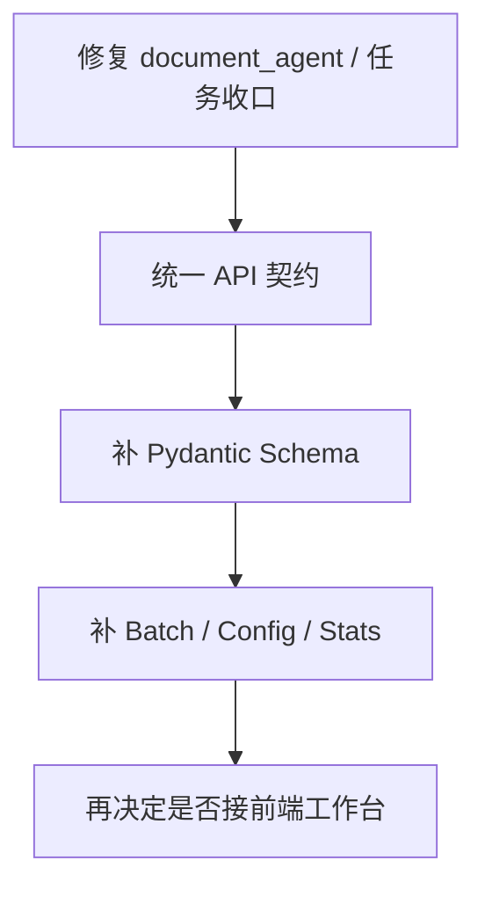

# 研究信息中台 MVP — 项目进度与质量分析报告

> 评估日期：2026-06-08
> 评估依据：`README.md`、`01第一期-研究信息中台MVP实施文档.md`、`03第一期-接口清单（API 设计）.md`、`05第一期项目目录结构与代码骨架设计.md`、`06第一期数据库建表SQL初稿.sql`，以及 `app/`、`tests/`、`scripts/` 下核心实现文件
> 评估方法：信息采集 → 进度比对 → 质量审查 → 综合评估 → 报告产出
> 运行验证：`pytest` 39/39 通过；`psql -d investment_research_mvp -f scripts/verify_schema.sql` 实测返回 3 个扩展、15 张表、82 个索引

---

## 执行摘要

当前项目已经完成后端 MVP 的主体闭环，整体完成度评估为 **76%**。文档上传、文档解析、混合检索、RAG 问答（先检索资料片段再让模型回答的方式）、任务记录、研究备忘录/日报生成、研究资产保存与导出，均有真实代码和集成测试证据支撑。

从“能否演示 MVP”角度看，当前后端已经可以支撑一期核心验收标准：上传文档后可检索、问答结果有引用、可生成备忘录/日报、结论可回到原文片段。`tests/test_api_smoke.py:1` 只是入口包装，真实冒烟逻辑位于 `scripts/smoke_api.py:120`，它实际跑通了上传 TXT/DOCX/PDF、检索、问答、任务、资产、导出链路。

当前最重要的两个风险不是“没代码”，而是“契约偏差”和“路由断点”。第一，接口设计文档中的若干端点尚未落地，或路径已经漂移，例如设计文档要求 `/api/v1/search/retrieve`、`/api/v1/qa/memo-generate`、`/api/v1/qa/daily-report-generate`，但实际实现为 `/api/v1/search`、`/api/v1/qa/memo`、`/api/v1/qa/daily-report`。第二，总控 Agent 会把“文档入库任务”路由到 `document_agent`，但当前并没有注册该 Agent，导致这条任务链在统一任务入口里并不闭环。

建议下一步先做三件事：补齐文档任务路由闭环、收敛接口契约与文档、把配置/统计/批量文档接口补到位。这样做可以在不推翻现有实现的前提下，把项目从“可演示的后端 MVP”推进到“接口稳定、便于前端接入的一期版本”。

---

## 0. 评分标准

| 评分 | 定义 |
|------|------|
| 5/5 | 代码、接口、测试、运维配套都基本闭环，接近可持续迭代状态 |
| 4/5 | 核心功能闭环，可运行，有明确边界缺口 |
| 3/5 | 主链路可用，但存在较明显的契约或结构缺口 |
| 2/5 | 只有部分模块落地，无法构成稳定演示闭环 |
| 1/5 | 以文档或占位代码为主，缺少可验证实现 |

本项目本次综合评级：**3.8 / 5**。

---

## 1. 任务进度梳理

### 1.1 已完成任务

| 模块 | 任务 | 状态 | 证据 |
|------|------|------|------|
| 项目骨架 | FastAPI 入口、配置、错误处理、中间件 | ✅ 完成 | `app/main.py:15`、`app/main.py:27`、`app/core/middleware.py:9`、`app/core/exceptions.py:5` |
| 数据与文档底座 | PostgreSQL 连接池、15 张核心表、82 个索引 | ✅ 完成 | `app/db/session.py:11`、`06第一期数据库建表SQL初稿.sql:1`，以及 2026-06-08 `psql` 实测结果 |
| 文档管理 | 文档上传、入库、列表、详情、切片、预览、软删除 | ✅ 完成 | `app/api/routers/documents.py:27`、`app/services/documents.py:42`、`app/services/documents.py:107`、`app/services/documents.py:193`、`app/services/documents.py:280` |
| 文档解析 | TXT/Markdown/CSV/JSON/HTML/PDF/DOCX 读取与切分 | ✅ 完成 | `app/services/text.py:22`、`app/services/text.py:31`、`app/services/text.py:46`、`app/services/text.py:66` |
| 检索与问答 | 混合检索（关键词 + 向量相似度）、问答、引用落库、SSE 流式问答 | ✅ 完成 | `app/services/search.py:12`、`app/services/search.py:57`、`app/services/search.py:101`、`app/api/routers/qa.py:45` |
| 任务体系 | 任务创建、执行、任务运行记录 | ✅ 完成 | `app/api/routers/tasks.py:10`、`app/services/tasks.py:10`、`app/services/tasks.py:47`、`app/services/tasks.py:194` |
| Agent/Skill | 总控 Agent、研究 Agent、报告 Agent、Skill 注册表 | ✅ 完成 | `app/agents/orchestrator_agent.py:22`、`app/agents/research_agent.py:16`、`app/agents/reporting_agent.py:66`、`app/skills/registry.py:31` |
| 报告与资产 | 研究备忘录、晨会日报、周报、投决材料、资产版本、Markdown/DOCX 导出 | ✅ 完成 | `app/services/reports.py:144`、`app/services/reports.py:164`、`app/services/reports.py:227`、`app/services/reports.py:246`、`app/services/assets.py:121`、`app/services/assets.py:185` |
| 公司/标签/Prompt | 公司主数据、标签、Prompt 模板种子与 CRUD | ✅ 完成 | `app/api/routers/companies.py:12`、`app/api/routers/tags.py:10`、`app/services/prompts.py:200`、`app/api/routers/prompts.py:10` |
| 测试与回归 | 单元测试、检索评估脚本、端到端冒烟测试 | ✅ 完成 | `tests/test_core_units.py:79`、`tests/test_api_smoke.py:1`、`scripts/smoke_api.py:120`、`scripts/eval_retrieval.py:85` |

### 1.2 进行中任务

| 模块 | 任务 | 当前状态 | 阻塞因素 |
|------|------|----------|----------|
| 总控 Agent | 文档入库类任务统一走 Agent 编排 | ⚠️ 只完成“路由决策”，未完成“可执行闭环” | `decide_route` 会返回 `document_agent`，但当前仅注册 `research_agent`、`report_agent`、`orchestrator_agent`；且编排器只会真正调用前两者。证据：`app/agents/orchestrator_agent.py:36`、`app/agents/orchestrator_agent.py:73`、`app/agents/supervisor.py:12` |
| 研究资产生命周期 | 版本追加已支持，但回滚和删除接口未落地 | ⚠️ 部分完成 | 已有 `GET /revisions` 与 `POST /export`，但设计文档中的 rollback/delete 端点未实现。证据：`app/api/routers/assets.py:35`、`app/api/routers/assets.py:40`、`app/api/routers/assets.py:50` |
| Prompt/配置治理 | Prompt 模板已支持，系统配置 API 未落地 | ⚠️ 部分完成 | `prompt_templates` 表和 CRUD 已有，但 `configs` 路由缺失。证据：`app/services/prompts.py:109`、`03第一期-接口清单（API 设计）.md:1458` |

### 1.3 未开始任务

| 模块 | 任务 | 优先级 | 说明 |
|------|------|--------|------|
| 前端工作台 | 上传页、问答页、备忘录页、日报页、资产列表页 | P1 | 设计文档规划了最小前端工作台，但项目目录中没有前端工程文件，也没有 `package.json` |
| 批量文档接口 | `batch-upload`、`batch-ingest`、`batch-delete`、`trash` | P1 | API 设计文档已列出，当前 `documents` 路由未实现对应接口。证据：`03第一期-接口清单（API 设计）.md:528`、`592`、`773`、`789`；`app/api/routers/documents.py:27-102` |
| 统计看板接口 | 文档/检索/资产/任务统计 | P2 | API 设计文档已列出，当前没有 `stats` 路由与服务实现。证据：`03第一期-接口清单（API 设计）.md:1498`、`1532`、`1552`、`1577` |
| 配置接口 | `GET /configs`、`PUT /configs/{config_key}` | P2 | 表结构已在 SQL 中存在，接口未暴露。证据：`06第一期数据库建表SQL初稿.sql:225`、`03第一期-接口清单（API 设计）.md:1458` |
| 部署配套 | Dockerfile、docker-compose、Makefile | P2 | 根目录未发现对应文件，当前依赖 README 手工启动 |

---

## 2. 已完成任务质量检查

### 2.1 功能测试评估

#### 文档链路

- 实现文件：`app/api/routers/documents.py`（102 行），`app/services/documents.py`（284 行），`app/services/text.py`（211 行）
- 已验证功能：
  - ✅ 上传文件并写入 `documents` 表：`app/services/documents.py:42`
  - ✅ 支持 PDF/DOCX/TXT/Markdown/CSV/JSON/HTML：`app/services/documents.py:16`、`app/services/text.py:22`
  - ✅ 入库时删除旧 chunk、重建新 chunk、写入 embedding：`app/services/documents.py:145`
  - ✅ 列表、详情、chunk、预览、软删除：`app/services/documents.py:193`、`230`、`254`、`274`、`280`
  - ✅ 冒烟测试真实验证 TXT/DOCX/PDF 三类文件：`scripts/smoke_api.py:148`
- 质量问题：
  - ⚠️ `document_chunks` 表中有 `page_no`、`position_start`、`position_end` 字段，但当前入库逻辑没有真正写入这些定位字段，引用可追到 chunk，但不一定能稳定追到页码与位置。证据：`06第一期数据库建表SQL初稿.sql:69-87`，对照 `app/services/documents.py:151-169`
  - ⚠️ 解析能力对扫描版 PDF、复杂表格、噪声布局仍缺少专门回归样本。`README.md:63` 也明确写了这个限制

#### 检索与问答链路

- 实现文件：`app/services/search.py`（304 行），`app/services/llm.py`（195 行），`app/services/embeddings.py`（102 行）
- 已验证功能：
  - ✅ 混合检索（同时结合关键词匹配和向量相似度的检索方式）：`app/services/search.py:12`
  - ✅ 引用落库：`app/services/search.py:57`
  - ✅ 同步问答任务执行与状态流转：`app/services/search.py:101`
  - ✅ 流式问答：`app/api/routers/qa.py:45`
  - ✅ 冒烟测试验证搜索命中、问答成功、引用持久化：`scripts/smoke_api.py:153`、`156`、`168`
- 质量问题：
  - ⚠️ 当外部 embedding 服务未配置时，会退回 `local_hash` 嵌入，这是一种本地哈希向量，不等于生产级语义向量。功能可跑，但召回质量上限受限。证据：`app/services/embeddings.py:37-63`
  - ⚠️ `system_info` 会暴露 `rerank_enabled`，但当前检索逻辑没有单独的 rerank 服务实现，更多是“预留开关”而非“已落地重排”。证据：`app/main.py:54-65` 对照 `app/services/search.py:12-54`

#### Agent 与报告链路

- 实现文件：`app/agents/*.py`、`app/skills/research.py`、`app/services/reports.py`
- 已验证功能：
  - ✅ QA、摘要、结论、备忘录、日报、周报、投决材料都能由 Agent/Skill 调用：`app/skills/research.py:17-96`
  - ✅ 晨会日报、备忘录等研究产出会沉淀为 `research_assets` 并绑定 citations：`app/services/reports.py:383-406`
  - ✅ 冒烟测试验证 `/agents/route`、`/qa/memo`、`/qa/daily-report`、资产导出：`scripts/smoke_api.py:210`、`219`、`239`、`247`
- 质量问题：
  - ⚠️ 文档入库类型的 Agent 任务没有执行体。路由规则有，真正的 `document_agent` 没有。证据：`app/agents/orchestrator_agent.py:73-74`、`app/agents/supervisor.py:12-18`
  - ⚠️ `/tasks` 统一任务入口对非 QA 任务的闭环状态管理不完整。`execute_task` 只记录路由与 agent run，自身不负责调用 `complete_task`；QA 之所以闭环，是因为 `research.qa` skill 内部额外完成了任务收口。若是 memo/report/document ingest 类型，通过 `/tasks` 执行时存在状态悬空风险。证据：`app/services/tasks.py:47-92` 对照 `app/services/search.py:145-163`

#### 研究资产链路

- 实现文件：`app/services/assets.py`（267 行）
- 已验证功能：
  - ✅ 创建资产、追加 revision、查询 sources/tags：`app/services/assets.py:10`、`121`、`154`
  - ✅ Markdown/DOCX 导出：`app/services/assets.py:185`
  - ✅ 冒烟测试验证版本递增、导出文件落盘：`scripts/smoke_api.py:277`、`292`、`294`
- 质量问题：
  - ⚠️ 有 revision 但无 rollback API，意味着版本历史只能看、不能回退
  - ⚠️ 资产删除接口未暴露，生命周期治理不完整

### 2.2 代码质量评估

#### 架构一致性

设计文档推荐的骨架包含 `models/`、`repositories/`、`services/`、`agents/`、`skills/`、`workflows/`、`llm/`、`db/` 等分层（参见 `05第一期项目目录结构与代码骨架设计.md` 的第 4 节）。当前代码实际已经有 `api/`、`core/`、`db/`、`services/`、`agents/`、`skills/`，但没有单独的 `models/`、`repositories/`、`workflows/`；`app/api/schemas` 目录存在但为空。

这意味着当前架构更像“可运行的 MVP 后端”，而不是“严格按目录设计文档收敛后的长期结构”。短期内这没有阻塞演示，但随着接口和数据模型继续增长，service 层会持续承担 SQL、编排、数据转换和业务规则，后续重构成本会上升。

#### 数据访问质量

- 正向证据：
  - 大多数 SQL 都使用参数化查询，常见 SQL 注入风险较低。证据：`app/services/documents.py:76-103`、`app/services/search.py:24-52`、`app/services/tasks.py:12-24`
  - 文档入库在 `conn.transaction()` 中完成“删旧 chunk + 插新 chunk + 更新状态”，事务边界明确。证据：`app/services/documents.py:145-180`
- 风险点：
  - `services` 层直接承担了大量 SQL 读写逻辑，缺少 repository 层隔离；后续更换存储策略或补充缓存时改动面会比较大
  - `tags.attach_tags/list_resource_tags/detach_tag` 使用动态表名与列名拼接，虽然当前调用参数来自内部常量，不是用户输入，但可维护性较弱。证据：`app/services/tags.py:63-91`

#### 错误处理

- 已实现：
  - 统一业务异常 `AppError` 与统一错误响应：`app/core/exceptions.py:5-32`
  - 文档解析失败会回写 `parse_status = 'failed'` 和 `parse_error`：`app/services/documents.py:184-190`
  - 任务执行失败会写 `tasks.error_message` 和失败 run：`app/services/tasks.py:93-106`
- 评价：
  - 错误处理覆盖主路径，评分 **4/5**

#### 输入验证

- 已实现：
  - `documents.ingest`、`search`、`qa` 使用了 Pydantic 请求模型：`app/api/routers/documents.py:14-24`、`app/api/routers/search.py:11-15`、`app/api/routers/qa.py:17-31`
- 缺口：
  - `companies`、`tags`、`tasks`、`assets`、`prompts` 等多个入口仍直接接收 `dict`，缺少字段级校验和更稳定的请求契约。证据：`app/api/routers/companies.py:31-33`、`app/api/routers/tags.py:15-21`、`app/api/routers/tasks.py:10-15`、`app/api/routers/assets.py:10-12`、`app/api/routers/prompts.py:20-26`
- 评价：
  - 输入验证覆盖部分高频链路，但未形成统一 schema 层，评分 **3/5**

### 2.3 测试覆盖评估

| 测试类型 | 现状 | 证据 |
|------|------|------|
| 单元测试 | 有，覆盖 chunk、embedding、LLM fallback、Agent 路由、任务生命周期、资产版本等 | `tests/test_core_units.py` 共 784 行 |
| 冒烟测试 | 有，真实跑通 API、数据库、文档上传、问答、导出 | `tests/test_api_smoke.py:1`、`scripts/smoke_api.py:120` |
| 检索评估脚本 | 有，支持 JSONL case 回归 | `scripts/eval_retrieval.py:85` |
| 覆盖率统计 | 无显式覆盖率报告 | 未发现 coverage 配置或产物 |
| CI 配置 | 未发现 | 根目录未发现 CI 文件 |

结论：测试不是空壳，尤其是冒烟测试价值较高；但目前更偏“功能回归”而非“契约回归 + 覆盖率治理 + 自动化持续集成”。

### 2.4 数据模型评估

- 2026-06-08 实测数据库状态：
  - 扩展：`uuid-ossp`、`pg_trgm`、`vector`
  - 表数量：15
  - 索引数量：82
  - 向量列：`document_chunks.embedding`
  - 向量索引：`idx_document_chunks_embedding`
- 评价：
  - 数据模型已经不是“纸面设计”，而是实际建表并可跑查询
  - `system_configs`、`prompt_templates`、`asset_revisions` 等预留结构已经准备好，说明后续扩展位充分
  - 但迁移体系尚未出现，目前仍依赖初始 SQL 文件一次性建库，后续版本演进的可追踪性一般

---

## 3. 下一步任务评估

### 3.1 完成度计算

本次按模块加权评估：

| 模块 | 权重 | 完成度 | 说明 |
|------|------|--------|------|
| 项目骨架 | 10% | 95% | 启动、配置、错误处理、数据库接入已完成 |
| 数据与文档底座 | 15% | 85% | 表结构、上传、元数据录入已完成 |
| 文档解析链路 | 15% | 80% | 解析和切分可用，但页码/位置字段利用不足 |
| 检索与知识库 | 15% | 80% | 混合检索与引用落库已完成，embedding/rerank质量仍有限 |
| 总控 Agent | 10% | 65% | QA/报告路由可用，文档入库任务未闭环 |
| 研究 Agent | 10% | 80% | QA、摘要、结论、备忘录可用 |
| 报告协作 Agent | 10% | 75% | 日报/周报/投决材料与导出可用 |
| 引用与研究资产 | 10% | 80% | 资产版本与导出已完成，回滚/删除缺失 |
| 前端工作台 | 5% | 0% | 未开始 |
| 质量与可维护性 | 10% | 45% | 测试存在，但接口治理、配置/统计/batch、迁移体系未补齐 |

**整体完成度：76%**

```text
整体进度  [###############-----] 76%
P0 核心   [##################--] 86%
P1 能力   [###############-----] 74%
P2 配套   [###-----------------] 16%
```

> 图表说明：当前会话未提供交互式 chart/widget 工具，以下使用 Mermaid 作为替代可视化。



### 3.2 优先级排序

#### P0 — 必须立即完成

| 任务 | 原因 | 预估工作量 |
|------|------|------------|
| 修复 `document_agent` 路由断点，打通文档入库任务的 Agent 闭环 | 这是统一任务入口的真实功能缺口，不修复就无法宣称“所有任务都走统一编排” | 0.5 到 1 天 |
| 明确 `/tasks` 对 memo/report/document ingest 的任务完成语义，并补 `complete_task` | 当前 QA 之外的任务存在状态悬空风险 | 0.5 到 1 天 |
| 统一接口契约：实现设计文档端点或更新设计文档为现状 | 前端或外部调用方会直接受到影响 | 1 天 |

#### P1 — 应该尽快完成

| 任务 | 原因 | 预估工作量 |
|------|------|------------|
| 补齐批量文档接口和回收站接口 | 设计文档已承诺，且属于实际运营效率功能 | 1 到 2 天 |
| 补齐资产 rollback/delete API | 研究资产版本链已经有表和 revision，实现回滚收益高 | 1 天 |
| 为 `companies/tags/tasks/assets/prompts` 补 Pydantic schema | 提高输入校验强度，减少接口漂移 | 1 到 2 天 |

#### P2 — 可以延后

| 任务 | 原因 | 预估工作量 |
|------|------|------------|
| 补 `configs` 与 `stats` 接口 | 对演示不是第一阻塞，但能提升治理和可观测性 | 1 到 2 天 |
| 引入数据库迁移工具 | 现在靠 SQL 初稿建库，后续版本追踪不方便 | 1 天 |
| 最小前端工作台 | 需要在接口稳定后再接入，避免前后端同时返工 | 3 到 5 天 |

### 3.3 推荐实施路径

#### 路径 A：先补接口契约和任务闭环

- 优点：最快把“后端可演示”提升为“后端可接入”
- 缺点：对长期架构优化帮助有限
- 适用场景：近期要接前端或给其他人联调

#### 路径 B：先补分层和 schema 治理

- 优点：中长期可维护性最好
- 缺点：短期用户可感知收益较少
- 适用场景：近期不急着演示，优先降低后续重构成本

#### 路径 C：折中路径，先修闭环，再做最小治理

- 步骤：
  1. 修复 `document_agent` 和非 QA 任务收口
  2. 收敛 API 路径与文档
  3. 给高频写接口补 schema
  4. 再补 batch/config/stats
- 推荐：**路径 C**
- 原因：它先解决真实功能断点和外部契约风险，再做低成本治理，投入产出比最高



---

## 4. 风险与建议

### 4.1 关键风险

| 风险 | 影响 | 应对措施 |
|------|------|----------|
| 统一任务入口对文档入库任务不闭环 | 任务看起来可路由，但实际上没有执行体，容易在联调时暴露为“能创建任务但无结果” | 新增 `document_agent`，或把入库逻辑并入现有 agent |
| 接口设计文档与实际路径漂移 | 前端或第三方会按文档调用旧路径，造成联调失败 | 二选一：补实现，或同步修正文档 |
| 输入校验不统一 | 直接接收 `dict` 的接口更容易出现字段缺失、类型错误、隐式兼容行为 | 为高频写接口补 schema 并沉淀到 `app/api/schemas` |
| embedding 默认可退回 `local_hash` | 这保证了功能可运行，但检索语义质量不稳定，可能影响研究结论质量 | 明确区分“开发回退模式”和“正式语义检索模式” |
| 缺少部署与迁移配套 | 新环境搭建依赖人工步骤，后续数据库升级难追踪 | 补 Dockerfile/Makefile 和迁移工具 |

### 4.2 改进建议

#### 立即行动

- 修复 `document_agent` 断点和非 QA 任务完成态
- 明确以哪个 API 契约为准，并同步代码或文档

#### 短期改进

- 给 `tasks/assets/companies/tags/prompts` 补请求模型
- 补 batch、rollback、delete、configs、stats 接口
- 给文档 chunk 补更稳定的页码与位置写入

#### 中期规划

- 引入 `repository` 或 `data access` 层，把 SQL 与编排逻辑解耦
- 引入数据库迁移工具
- 在接口稳定后再补最小前端工作台

---

## 5. 附录：代码文件清单

### 5.1 已实现文件（核心）

| 文件 | 行数 | 作用 |
|------|------|------|
| `app/main.py` | 67 | 应用入口与路由装配 |
| `app/services/documents.py` | 284 | 文档上传、入库、查询、删除 |
| `app/services/search.py` | 304 | 检索、问答、引用、流式输出 |
| `app/services/tasks.py` | 313 | 任务与任务运行记录 |
| `app/services/assets.py` | 267 | 研究资产与导出 |
| `app/services/reports.py` | 612 | 备忘录、日报、周报、投决材料 |
| `app/services/llm.py` | 195 | LLM 调用与 fallback |
| `app/services/text.py` | 211 | 文本读取与 chunk 切分 |
| `app/agents/` | 431 | 编排与专业 Agent |
| `tests/test_core_units.py` | 784 | 单元测试主文件 |
| `tests/test_api_smoke.py` | 5（入口） | 调用 `scripts/smoke_api.py` 的 smoke 包装 |
| `scripts/smoke_api.py` | 317 | 真实 API 集成验证脚本 |

总代码规模（`app/`）：**4073 行**

### 5.2 按设计文档规划但尚未形成稳定实现的部分

| 项目 | 现状 |
|------|------|
| `models/` / `repositories/` / `workflows/` | 设计文档建议存在，当前未形成独立目录与层次 |
| `app/api/schemas` | 目录存在，但当前无文件 |
| 批量文档接口 | 未实现 |
| 配置接口 | 未实现 |
| 统计看板接口 | 未实现 |
| 资产 rollback/delete | 未实现 |
| 前端工作台 | 未开始 |
| Docker/Makefile/迁移体系 | 未发现 |

---

## 6. 结论

如果以“一期后端 MVP 是否已经具备可演示闭环”为标准，本项目结论是：**是，已经具备**。如果以“是否已经和设计文档完全对齐、能平滑接前端和后续多人协作”为标准，结论是：**还差最后一轮接口治理和任务闭环修正**。

从投入产出比看，现在最值得做的不是大规模重构，而是先把统一任务入口、接口契约和缺失的 P1/P2 API 收口。完成这一步后，再决定是否补前端工作台和更深的分层重构，会更稳。

---

*报告生成时间：2026-06-08 12:38:57 CST*
*分析基于代码版本：2026-06-08*
